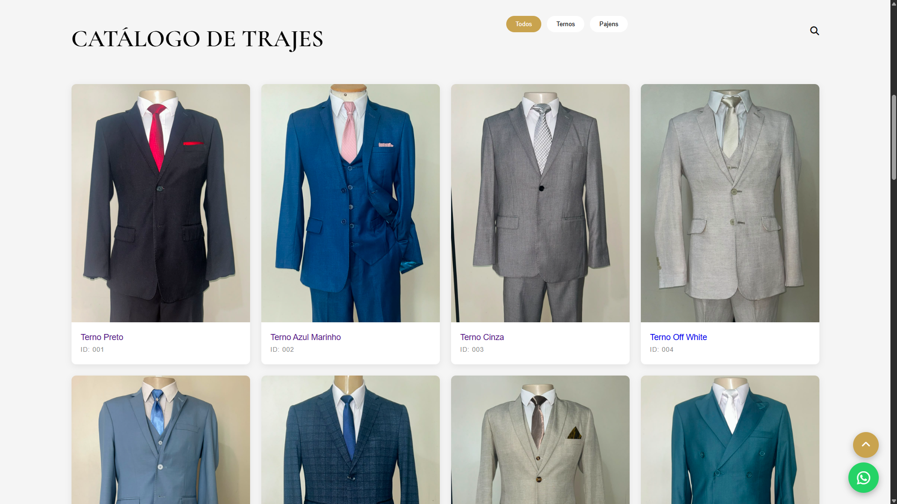
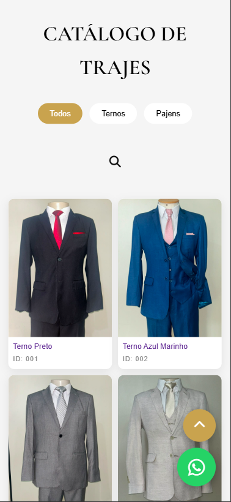

# Uomo Noivos - Website Institucional

Site institucional desenvolvido para uma loja especializada em trajes masculinos e vestuário para noivos.

🔗 **Deploy:** https://uomo-noivos-site.vercel.app

---

## Sobre o Projeto

Este projeto foi desenvolvido com o objetivo de criar uma presença digital moderna para uma loja de trajes masculinos, oferecendo aos visitantes uma experiência visual agradável e acesso organizado às informações da empresa e de seus produtos.

O foco principal foi aplicar conhecimentos de desenvolvimento front-end em um projeto com características de um cenário real, priorizando organização, responsividade e experiência do usuário.

---

## Funcionalidades

- Página inicial institucional
- Catálogo de produtos
- Design responsivo para desktop, tablet e smartphone
- Navegação intuitiva entre páginas
- Formulário de contato
- Estrutura organizada e escalável
- Interface focada na experiência do usuário

---

## Tecnologias Utilizadas

- HTML5
- CSS3
- JavaScript
- Git
- GitHub
- Vercel

---

## Conceitos Aplicados

- Estruturação com HTML
- Responsividade com CSS
- Manipulação do DOM
- Organização de arquivos e componentes
- Controle de versão com Git
- Publicação de aplicações web

---

## Aprendizados

Durante o desenvolvimento deste projeto foram praticados conceitos importantes de desenvolvimento web, incluindo:

- Desenvolvimento de interfaces responsivas
- Estruturação de projetos front-end
- Versionamento de código com Git
- Hospedagem e deploy utilizando Vercel
- Construção de layouts voltados para negócios reais
- Boas práticas de organização de código

---

## Preview

### Página Inicial


### Catálogo



### Versão Mobile



---

## Como Executar o Projeto

Clone o repositório:

```bash
git clone https://github.com/brunonverde/uomo-noivos-site.git
```

Entre na pasta:

```bash
cd uomo-noivos-site
```

Abra o arquivo `index.html` em seu navegador.

---

## Autor

Bruno Verde

🔗 LinkedIn: https://linkedin.com/in/bruno-verde-4002673b2

🔗 GitHub: https://github.com/brunonverde
